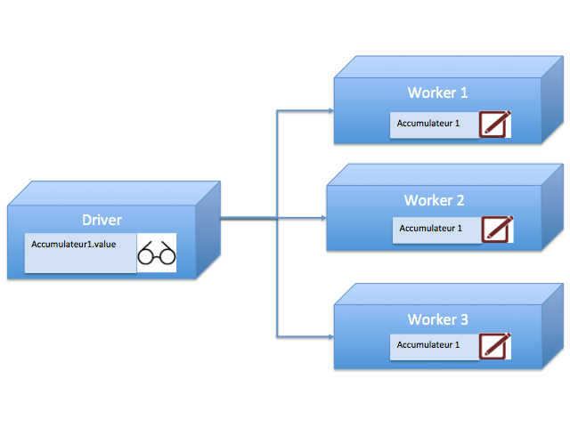
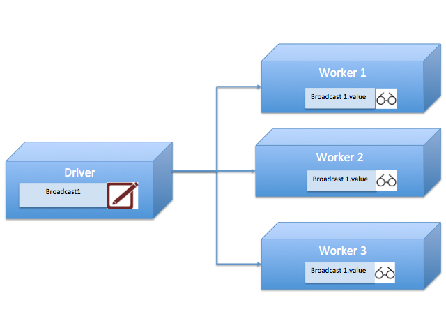

# Partie 3 : Aspects avancés de Spark
Tous les programmes Spark ne sont pas égaux. Spark offre plusieurs mécanismes d'amélioration des performances dont :
+ Le cache
+ Les accumulateurs
+ Le broadcast
+ Le partitionnement

## Le cache
Considérons l'exemple ci-dessous :
```scala
1. val lines = sc.textFile("...")
2. lines.count() // renvoie le nombre de lignes
3. lines.map(_.length).sortBy(x=> -x, ascending = false).first()
```

Dans l'exemple ci-dessus le fichier sera lu deux fois, une première fois à l'exécution de l'action ``count``et une seconde fois à l'action ``first``qui renvoie le premier élément du RDD (la ligne la plus longue).
```scala
// On rajoute l'appel à persist qui indique à Spark que le RDD ne doit pas être ``déchargé`` suite à l'exécution de l'action qui va suivre.
val lines = sc.textFile("...").persist(StorageLevel.MEMORY_AND_DISK)

lines.count() // renvoie le nombre de lignes
lines.map(_.length).sortBy(x=> -x, ascending = false)

// Le RDD est supprimé du cache.
lines.unpersist()

```

### La sérialisation
L'option ``MEMORY_AND_DISK`` indique que Spark peut persister les données sur le disque si la mémoire est insuffisante. D'autres options sont disponibles et permettent par exemple de réduire l'empreinte mémoire des objets (au détriment de la CPU toutefois).

Si les opérations requièrent un nombre important d'échange entre les noeuds du cluster, un algorithme de sérialisation performant en temps d'exécution et capable de générer une représentation plus compacte peut avoir un impact positif sur la performance globale. 

Spark permet de personnaliser le librairie de sérialisation. L'exemple ci-dessus illustre la mise en oeuvre de la dé/sérialisation avec Kryo.
```Scala
val conf = new SparkConf()
conf.set("spark.serializer", ""org.apache.spark.serializer.KryoSerializer)
conf.set("spark.kryo.registrationRequired", "true")
conf.registerKryoClasses(Array(classOf[Class1], classOf[Class2], classOf[Class3]))
```


## Les accumulateurs
Consiste à définir une variable qui sera mise à jour par l'ensemble des noeuds du cluster lors de l'exécution de l'action. Cette variable pourra ensuite être lue sur le driver.


Un accumulateur ne doit jamais être mis à jour dans le cadre d'une transformation. Spark étant susceptible de rexécuter les transformations en cas de panne, cela résulterait à une double mise à jour de la valeur de l'accumulateur.

```scala
val accumSum: Accumulator[Int] = sc.accumulator(0)
val accumCount: Accumulator[Int] = sc.accumulator(0)
val rdd = sc.parallelize(1 until 10000)
rdd.foreach { x =>
  accumSum += x
  accumCount += 1
}
println("mean of the sum=" + accumSum.value / accumCount.value)

```

Un accumulateur est mis à jour par les noeuds du cluster et consulté au niveau du driver.

## Le broadcast

Le broadcast permet diffuser sur tous les neouds du cluster, des données de référence qui pourront être accédées par les transformations et l'action lors de l'exécution.

La variable de broadcast héberge en général des données de référence.

```scala
val labels: Broadcast[Map[Int, String]] = sc.broadcast(Map(1 -> "Un", 2->"2", 3 -> "3"))
val rdd = sc.parallelize(1 to 3)
rdd.foreach { x =>
    // Affiche les bales correspondant aux identifiants numériques
    // en s'appuyant sur les labels diffusés sur chacun des noeuds
    println(labels.value(x))
}
```


## Le partitionnement
Lorsqu'un RDD est utilisé plusieurs fois de suite, dans des actions différentes et donc dans des cycles distincts d'exécution du RDD, Spark est amené à recalculer le partitionnement des données sur le cluster. Cela peut avoir un effet négatif sur les performances.

Dans un système distribué les communications sont coûteuses, il est donc impératif de les limiter en renforçant la colocalisation des données. Spark permet d'indiquer la règle de répartition des données sur les partitions, par contre cela a un intérêt uniquement dans le cas des opérations sur les clefs dans le cadre des RDDs clefs/valeurs. Cela concerne notamment les opérations de type ``join``, ``cogroup``, ``reduceByKey``

Le résultat du partitionnement doit systématiquement être mis en cache si l'on ne veut pas que les appels subséquents conduisent à un nouveau partitionnement du RDD.

Les transformations susceptibles de modifier la clef (tel que ``map``) conduisent Spark à reconstruire le partitionnement du RDD parent.


L'exemple ci-dessous illustre l'utilisation du partitionnement
```Scala
val lines : RDD[(Text, Int)] = sc.sequenceFile[String, Int]("/path").partitionBy(new HashPartitioner(10)).persist()
val other = lines.mapValues(_ + 1)
lines.join(other)

```

Un fichier Hadoop est chargé dans un RDD en utilisant un partitionnement que l'on a pris le soin de mettre en cache.

Un nouvel RDD est créé mais en maintenant les clefs colocalisés sur les mêmes noeuds que le RDD parent.

Le ``join`` est réalisé avec une performance optimale.

### Repartitionnement
Suite à des opérations de transformation réduisant de manière significative la taille du RDD, il peut être utile de réduire le nombre de paritions. C'est ce que permet la transformation ``coalesce``

```scala
lines.filter(x => x._2 < 3).coalesce(3)
```
