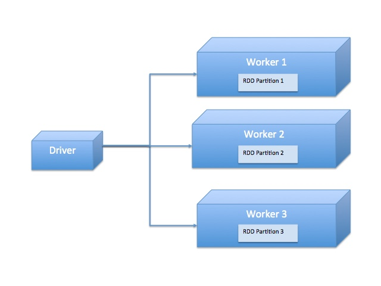
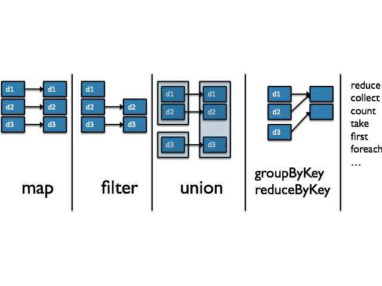
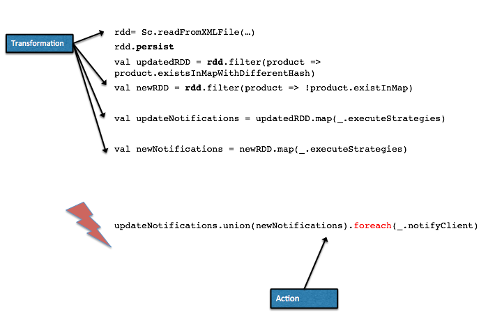

# Partie 2 : Mise en oeuvre des RDDs


Les RDDs sont une collection d'objets immuables répartis sur plusieurs noeuds d'un cluster. Un RDD est créé à partir d'un source de données ou d'une collection d'objets Scala / Python ou Java.


Les opérations disponibles sur un RDD sont :
+ La création
+ Les transformations
+ L'action



Le RDD peut subir des transformations successives au travers de fonctions similaires à celles présentes dans les collections "classiques. on peut citer par exemple :

+ ``map``: renvoie un nouveau RDD avec application d'une fonction de transformation sur chacun des objets du RDD initial
+ ``filter``: renvoie un nouveau RDD qui contiendra un sous ensemble des données contenues dans le RDD initial.

Les opérations de création et de transformation de RDDs ne déclenchent aucun traitement sur les noeuds du cluster. Seul le driver est sollicité. Le driver va construire un graphe acycilique dirigé des opérations qui seront être exécutées sur le cluster au moment de l'application d'une action.

Le cycle de vie d'un RDD est donc le suivant :
```scala
1. rdd1 = création du RDD à partir d'une source de données ou d'une collection
2. rdd2 = rdd1.tranform1(fonctionDeTransformationAAppliquerSurChaqueElement)
3. rdd3 = rdd2.tranform2(fonctionDeTransformationAAppliquerSurChaqueElement)
4. ...
5. ...
6. ...
7. rddn = rddm.tranform3(fonctionDeTransformationAAppliquerSurChaqueElement)
8. objet = rddn.action
```
Une seule action peut être appliquée. Elle consiste à exécuter une opération sur tous les noeuds du cluster et à renvoyer le résultat au driver. L'action peut ne produire aucun résultat, l'action ``foreach``par exemple,ou produire un résultat qui soit un objet ou une collection. On peut citer en exemple :
+ ``reduce``qui renvoie un objet unique (Equivalent à  [Java reduce]() et [Scala reduce](http://www.scala-lang.org/api/2.11.4/index.html#scala.collection.immutable.List))
+ ``take``qui renvoie les n premiers éléments d'un RDD (Equivalent à  [Java take]() et [Scala take](http://www.scala-lang.org/api/2.11.4/index.html#scala.collection.immutable.List))



## Création d'un RDD
Un RDD peut être créé à partir d'une collection ou d'une source de données.

### Création à partir d'une collection

```scala
val rdd1 : RDD[Int] = sc.paralellize(List(1, 2, 3, 4))
val rdd2 : RDD[Int] = sc.paralellize(List("Hello", "Distributed", "World"))
val rdd3 : RDD[Int] = sc.paralellize(1 until 1000000)
```

### Création à partir d'une source de données
```scala
val lines1 : RDD[String] = sc.textFile("hdfs://....")
val lines2 : RDD[(String,String)] = sc.wholeTextFiles("file://path/")

// Création à partir d'une base de données JDBC
def connect() = {
  Class.forName("org.postgresql.Driver").newInstance()
  DriverManager.getConnection("jdbc:postgresql://localhost/mogobiz")
}
def readRecord(res : ResultSet) : (Long, String) = (res.getLong(1), res.getString(2))

val jdbcInputRDD = new JdbcRDD(sc, connect, "select age, name from Account offset ? limit ?", lowerBound = 100, upperBound= 20000, 
                               numPartitions = 10, mapRow = readRecord)

```

``textFile`` et ``wholeTextFile`` permettent de créer un RDD à partir d'un fichier unique ou d'un répertoire. Dans ce deuxième cas, tous les fichiers présents dans le répertoire seront chargés.

+ ``textFile`` va créer un RDD dont chaque élément correspond à une ligne du fichier
+ ``wholeTextFile`` va créer un RDD dont chaque élément contiendra le nom du fichier (la clef: premier élément du tuple) et le contenu du fichier en entier (la valeur : deuxième élément du tuple). cette méthode est adaptée lorsqu'une ligne du fichier ne correspond pas à un enregistrement, cela concerne notamment les fichiers JSON et XML par exemple.

##Transformations d'un RDD

La ligne ci-dessous récupère exclusivement les noms des personnes majeures.
```scala
val namesRDD : RDD[String]= jdbcInputRDD.filter(tuple => tuple._1 >= 18).map(_._2)
```

Nous pouvons trier les utilisateurs par ordre croissant en utilisant la méthode `òrderBy``
```scala
val sortedNamesRDD = namesRDD.sortBy(x => x)
```

## Actions sur un RDD
Une fois l'action exécutée, l'ensemble des données résultant de cette action est rapatriée sur le driver. L'action est celle qui déclenche l'exécution sur les noeuds du cluster de la création, de la transformation, de l'action et du rapatriement des données issues des calculs sur le driver.

L'action ci-dessous récupère les 10 premiers noms
```Scala
val firstNames : Array[String] = sortedNamesRDD.take(10)
```
L'exemple ci-dessus illustre bien que l'action conditionne le début et la fin de l'exécution du traitement sur les noeuds du cluster.

Un opération sur un RDD est une action lorsqu'elle ne renvoie pas de RDD mais qu'elle renvoie un objet ou une collection Scala standard.

Certaines actions peuvent ne rien renvoyer du tout, comme cela est le cas pour l'action ``foreach``.


#Exercice 1

```scala
  def main(args: Array[String]): Unit = {
    val conf = new SparkConf().setAppName("Workshop").setMaster("local[*]")
    // Fichier de rating au format userid\tmovie\trating\ttimestamp
    val url = Paths.get(getClass.getResource("/ratings.txt").toURI).toAbsolutePath.toString
    val sc = new SparkContext(conf)

    // Charger le fichier de ratings dans un RDD
    val baselines: RDD[Seq[String]] = sc.textFile(url).map(_.split('\t'))
    val lines: RDD[Rating] = baselines.map(row => Rating(row(0).toLong, row(1).toLong, row(2).toInt, new Timestamp(row(3).toLong * 1000)))

    // calculer la moyenne, le min, le max et le nombre d'éléments pour l'utilisateur avec l'id 200
    // ...

    println( s"""
    count=$count
    min=$min
    mean=$mean
    max=$max
      """)
  }
}

```


## Les Pairs RDD


