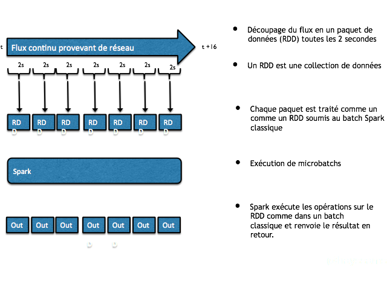
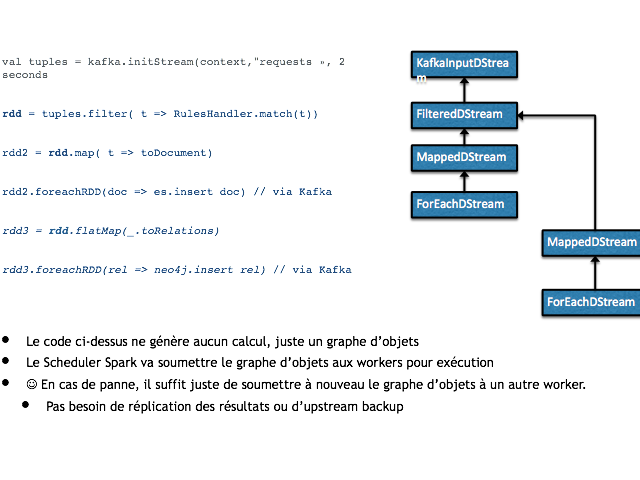

# Partie 4 : Spark Streaming





```scala
object Workshop9 {
  def main(args: Array[String]): Unit = {
    val conf = new SparkConf().setAppName("Workshop").setMaster("local[*]")
    val ssc = new StreamingContext(conf, Seconds(1))
    ssc.checkpoint("/tmp/spark")
    val lines: ReceiverInputDStream[String] = ssc.socketTextStream("localhost", 7777)
    val res: DStream[(String, Int)] = lines.flatMap(x => x.split(" ")).map(x => (x, 1)).reduceByKeyAndWindow(_ + _, _ - _, Seconds(30), Seconds(10))
    res.checkpoint(Seconds(100))
    res.foreachRDD(rdd => rdd.foreach(println))
    res.print()

//    lines.print()
    ssc.start()
    ssc.awaitTermination()
  }
}

```

Pour tester le streaming, il nous faut un serveur de test. 
Sur macos, il suffit de lancer ``ncat`` avec la commande ``nc``suivante :
```sh
$ nc -l localhost 7777
```

Sur Windows, ``ncat`` peut être téléchrgé sur [nmap.org](https://nmap.org/ncat/)